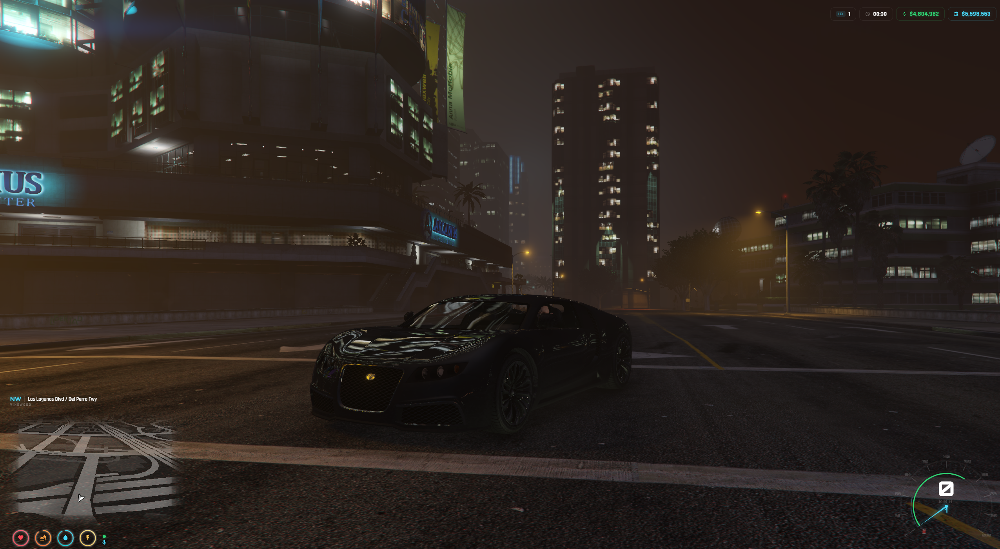

# mid-hud — FiveM HUD & Speedometer



A lightweight, customizable HUD and speedometer for FiveM servers.
Supports ESX Legacy, QBCore, and ox_core frameworks.
Features animated status rings, real-time speedometer with RPM and fuel gauge,
location panel, voice indicator, and cinematic mode.

> Free, open-source FiveM HUD resource with auto-detection for all major frameworks and fuel/voice systems.

## Features

- **Status rings** — health, armor, hunger, thirst, stamina, oxygen, stress with animated circular indicators
- **Speedometer** — real-time gauge with needle, tick marks, speed labels, RPM arc, and fuel arc
- **Smooth animations** — 60fps rendering via requestAnimationFrame, no stuttering
- **Location panel** — street name, area, compass heading
- **Top panel** — server ID, clock, cash, bank with animated money changes
- **Voice indicator** — 3-level voice proximity display
- **Cinematic mode** — hide HUD with keybind (default: Z)
- **Minimap integration** — custom minimap positioning

## Compatibility

### Frameworks
- ESX Legacy
- QBCore
- ox_core

### Fuel Systems
`ox_fuel` · `ps-fuel` · `cdn-fuel` · `lj-fuel` · `LegacyFuel` · GTA native

### Voice Systems
`pma-voice` · `mumble-voip` · `saltychat` · `toko-voip`

### Status Systems
`esx_status` · ESX metadata · QBCore metadata · ox_core

> All systems are auto-detected by default. You can override in `config.lua`.

## Installation

1. Drop `mid-hud` into your resources folder
2. Add `ensure mid-hud` to your `server.cfg`
3. Configure `config.lua` to your liking
4. Restart server

## Configuration

All settings are in `config.lua`:

```lua
Config.FuelSystem   = 'auto'   -- 'auto', 'ox_fuel', 'ps-fuel', 'cdn-fuel', 'lj-fuel', 'LegacyFuel', 'native'
Config.VoiceSystem  = 'auto'   -- 'auto', 'pma-voice', 'mumble-voip', 'saltychat', 'toko-voip'
Config.StatusSystem = 'auto'   -- 'auto', 'esx', 'esx_status', 'qb-core', 'ox_core'
Config.SpeedUnit    = 'kmh'    -- 'kmh' or 'mph'
Config.TimeOffset   = 2        -- UTC offset in hours
Config.UpdateInterval = 150    -- HUD refresh rate (ms)
```

## Exports

```lua
-- Toggle HUD visibility
exports['mid-hud']:ToggleHud(true/false)

-- Set stress level
exports['mid-hud']:SetStress(50)
```

## Events

```lua
-- Set stress from server
TriggerClientEvent('mid-hud:client:setStress', source, 50)
```

## Author

mid - [Discord](https://discord.gg/X2zBWC7hY4)

## License

MIT
